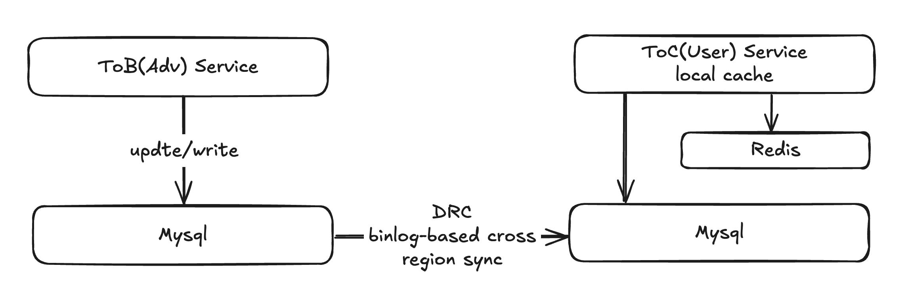

# PRD: Cross-DC Cache Sync for ToC Service

## 1. Overview

### 1.1 Background

High-traffic ToC web service in Golang (Gin, GORM), peak QPS millions. Flow: Request -> Local Cache -> Redis -> MySQL.

Table in /backend/pkg/repo/sql/web_product.sql, Extra JSON for configs.

ToC reads only, in DC B (US).

ToB writes/updates MySQL, low QPS, in DC A (SG).

Updates sync via binlog A to B, but no cache invalidation, causing 30min inconsistency (Redis TTL).

### 1.2 Problem

30min stale data affects UX.

### 1.3 Objectives

- Inconsistency <5min.
- Maintain high QPS.
- Reliable cross-DC, no SPOF.

## 2. Requirements

### 2.1 Functional

- Active cache invalidation (local, Redis) in B on A updates.
- Cross-DC sync via binlog or pub/sub.
- Fallback to TTL.
- Metrics: sync latency, failures, cache hits.

### 2.2 Non-Functional

- Latency +<100ms, handle peaks.
- Scalable.
- 99.99% uptime.
- Secure transmission.
- Low cost, use existing infra (RocketMQ, Kafka, etc.).

## 3. Constraints and Context

- Local cache TTL 15min.
- Redis TTL 30min, Redis deployed in cluster.
- Binlog sync ~200ms+ A to B.
- Minimize load.
- Real-time single updates via ToB.
- Available: RocketMQ, Kafka, Redis, FaaS, Spark, Flink, etc.
- Services distributed: ToB (A) dozens instances in DC A (SG), ToC (B) hundreds in DC B (US).

## 4. Special Note

[No need to implement it in prod env] Simulate distributed scenarios on single machine.

Follow-up on question1
