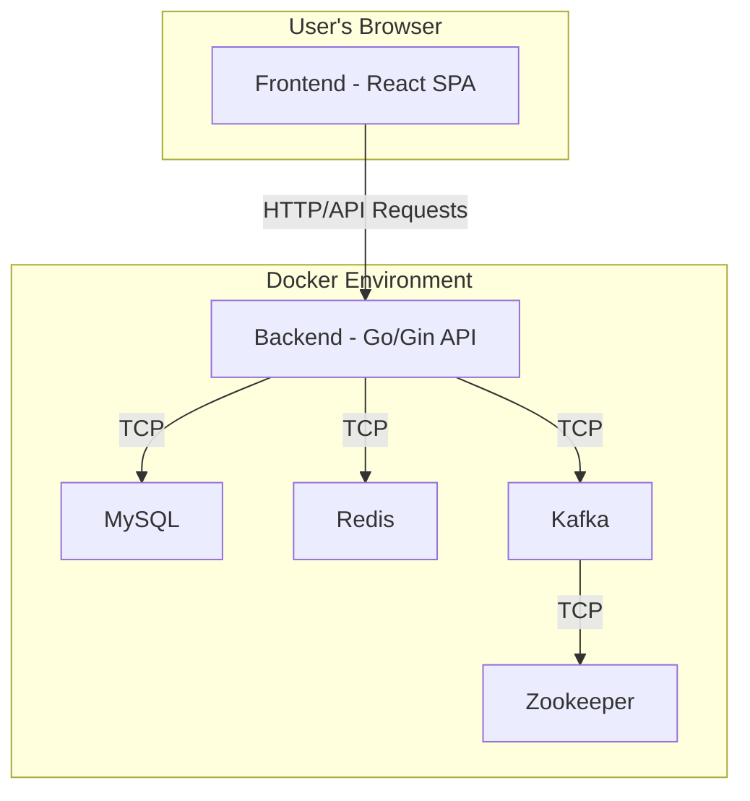

# Technical Specification: The Backend Problem Playground

## 1. Overview

This document provides a comprehensive technical implementation plan for "The Backend Problem Playground" project. The goal is to create an interactive, extensible, and educational platform for demonstrating complex backend engineering problems and their solutions. This specification is designed based on the Product Requirements Document (PRD), with a focus on modularity, scalability, and ease of deployment.

## 2. Technology Stack

To build a modern, high-performance, and maintainable system, we will use the following industry-standard technologies:

* **Backend**: **Go**
  * **Web Framework**: **Gin** ([https://github.com/gin-gonic/gin](https://github.com/gin-gonic/gin)). Gin is a high-performance Go web framework known for its minimalistic API and excellent performance. It provides robust routing, middleware, and request handling capabilities, making it ideal for building the project's RESTful API.
* **Frontend**: **React**
  * **Build Tool**: **Vite** ([https://vitejs.dev/](https://vitejs.dev/)). Vite offers an extremely fast cold start and Hot Module Replacement (HMR), significantly improving the development experience.
  * **UI Library**: **Ant Design** ([https://ant.design/](https://ant.design/)). A mature, enterprise-grade UI component library that will help us quickly build a professional and polished user interface.
* **Core Dependency Services**:
  * **Relational Database**: **MySQL 8.0**. A widely-used open-source relational database, suitable for persisting structured data required by various scenarios.
  * **Cache / Key-Value Store**: **Redis 7.0**. A high-performance in-memory data structure store, used for implementing caches, managing state, etc.
  * **Message Queue / Streaming Platform**: **Apache Kafka** ([https://kafka.apache.org/](https://kafka.apache.org/)). A powerful, distributed streaming platform capable of handling high-throughput, real-time data feeds. It is an industry standard for building event-driven architectures and is perfect for demonstrating asynchronous processing and eventual consistency patterns.
* **Containerization & Orchestration**: **Docker & Docker Compose**. As required by the PRD, all services (Backend, Frontend, MySQL, Redis, Kafka) will be containerized using Docker and orchestrated with a single `docker-compose.yml` file for one-click setup.

## 3. Architectural Design

### 3.1. High-Level Architecture

The system employs a classic client-server architecture with decoupled frontend and backend services. All services run in isolated containers managed by Docker Compose and communicate over a Docker network.



*Note: Kafka requires Zookeeper for cluster coordination.*

### 3.2. Backend Architecture: A Plugin-Based Scenario Design

The **core design principle** of the backend is **"Scenario as a Plugin"**. This pattern ensures the platform is highly extensible, allowing new scenarios to be added without modifying the core application logic.

1. **Scenario Interface**:
    A standard Go `interface` will be defined, which every scenario module must implement. This enforces a uniform structure across all scenarios.

    ```go
    // pkg/scenario/interface.go
    package scenario

    type Action struct {
        ID          string `json:"id"`
        Name        string `json:"name"`
        Description string `json:"description"`
    }

    type DashboardComponent struct {
        ID   string `json:"id"`
        Name string `json:"name"`
        Type string `json:"type"` // e.g., "key_value", "log_stream", "topic_messages"
    }

    type Scenario interface {
        // Metadata
        ID() string
        Name() string
        Category() string
        ProblemDescription() string
        SolutionDescription() string
        DeepDiveLink() string
        Actions() []Action
        DashboardComponents() []DashboardComponent

        // Core Logic
        ExecuteAction(actionID string, params map[string]interface{}) (interface{}, error)
        FetchState() (map[string]interface{}, error)
        Initialize() error // Used to set up resources for a scenario (e.g., create tables, seed data)
    }
    ```

2. **Scenario Registry**:
    On application startup, a central registry will automatically scan all packages under the `scenarios/` directory, call their initialization functions, and register them into a `map[string]Scenario`.

    * **Implementation**: This will be achieved using Go's `init()` function. Each scenario package will contain an `init()` function that instantiates itself and registers with the global registry.
    * **Benefit**: To add a new scenario, a developer only needs to create a new package implementing the `Scenario` interface. No changes are needed in the core modules, enabling true "hot-plug" capability.

3. **API Request Dispatching**:
    The Gin API handlers will parse the `scenario_id` and `action_id` from the URL. They will then use the Scenario Registry to find the corresponding `Scenario` instance and invoke its `ExecuteAction` or `FetchState` method.

### 3.3. Frontend Architecture

The frontend is a pure Single-Page Application (SPA) responsible for dynamically rendering scenario information fetched from the backend.

1. **Component-Based Structure**:
    * `ScenarioNavigator`: A sidebar component that lists all available scenarios fetched from `/api/scenarios`.
    * `ScenarioViewer`: The main view area that dynamically renders the `title`, `descriptions`, and `ActionButtons` for the selected scenario.
    * `ActionButtons`: A component that dynamically generates buttons based on the `actions` list defined by the scenario.
    * `Dashboard`: The real-time state visualization area. It will dynamically render different "Widgets" based on the `dashboard_components` defined by the current scenario.
    * `Widgets`: A collection of generic widgets like `KeyValueWidget`, `LogStreamWidget`, `GaugeWidget`, etc., used to visualize backend state.

2. **Data Flow**:
    * On application load, it first calls `GET /api/scenarios` to fetch the list of all scenarios and renders the navigator.
    * When a user selects a scenario, it calls `GET /api/scenarios/:id` to get the full configuration for that scenario and renders the `ScenarioViewer`.
    * The `Dashboard` component will start a timer to periodically call `GET /api/scenarios/:id/state` (e.g., every 2 seconds) to refresh its data, achieving near real-time updates.
    * Clicking an `ActionButton` triggers a `POST /api/scenarios/:id/actions/:action_id` request and displays a loading state during the call.

## 4. API Design

The API design strictly follows the definitions in the PRD, adhering to RESTful principles.

* **`GET /api/scenarios`**
  * **Description**: Retrieves a list of metadata for all available scenarios.
  * **Success Response (200 OK)**:

        ```json
        [
            {
                "id": "cache_inconsistency",
                "title": "DB/Cache Write Inconsistency",
                "category": "Distributed"
            }
        ]
        ```

* **`GET /api/scenarios/:id`**
  * **Description**: Retrieves the full configuration for a single scenario by its ID.
  * **Success Response (200 OK)**:

        ```json
        {
            "id": "cache_inconsistency",
            "title": "DB/Cache Write Inconsistency",
            "category": "Distributed",
            "problem_description": "...",
            "solution_description": "...",
            "deep_dive_link": "...",
            "actions": [
                { "id": "update_naive", "name": "Update Price (Naive)" },
                { "id": "update_with_fix", "name": "Update Price (Solution)" }
            ],
            "dashboard_components": [
                { "id": "mysql_record", "name": "MySQL Product Record", "type": "key_value" },
                { "id": "redis_key", "name": "Redis Cache Key", "type": "key_value" }
            ]
        }
        ```

* **`POST /api/scenarios/:id/actions/:action_id`**
  * **Description**: Executes a specific action for a given scenario.
  * **Request Body (Optional)**: `application/json`

        ```json
        {
            "params": { "product_id": 101, "new_price": 99.99 }
        }
        ```

  * **Success Response (200 OK)**:

        ```json
        {
            "status": "success",
            "message": "Action executed successfully.",
            "result": { }
        }
        ```

* **`GET /api/scenarios/:id/state`**
  * **Description**: Fetches the current state of a scenario's dashboard components.
  * **Success Response (200 OK)**:

        ```json
        {
            "mysql_record": { "id": 101, "name": "My Product", "price": 99.99 },
            "redis_key": "{\"id\":101,\"name\":\"My Product\",\"price\":89.99}"
        }
        ```

## 5. Project Directory Structure

The following directory structure is recommended to maintain clarity and modularity.

```
.
├── backend/                  # Go backend project
│   ├── cmd/
│   │   └── server/
│   │       └── main.go       # Application entrypoint
│   ├── internal/
│   │   ├── api/              # API routes and handlers
│   │   ├── config/           # Configuration loading
│   │   └── registry/         # Scenario registry
│   ├── pkg/
│   │   └── scenario/         # Scenario interface definition
│   └── scenarios/            # All scenario plugins
│       ├── cache_inconsistency/
│       │   └── cache.go
│       └── ...
├── frontend/                 # React frontend project
│   ├── public/
│   └── src/
│       ├── components/       # Common components (Dashboard, Widgets, etc.)
│       ├── layouts/          # Layout components
│       ├── scenarios/        # Scenario views
│       └── App.jsx
├── docs/
│   ├── prd.md
│   └── tech_design.md
└── docker-compose.yml        # Docker orchestration file
```

## 6. Development and Deployment

* **Development**: Developers can run `docker-compose up` to quickly spin up the entire development environment locally. Vite provides hot-reloading for the frontend. Backend code changes will require a container rebuild and restart.
* **Adding a New Scenario**:
    1. Create a new directory under `backend/scenarios/`, e.g., `new_problem/`.
    2. Create a Go file inside the new directory.
    3. Implement the `scenario.Scenario` interface.
    4. Register the new scenario in its `init()` function.
    5. If needed, add any new services (e.g., a specific database) to `docker-compose.yml`.
    6. Restart the services. The new scenario will automatically appear in the frontend.

This technical specification provides a solid foundation for the project. The next step is to build the project scaffold according to this plan.
